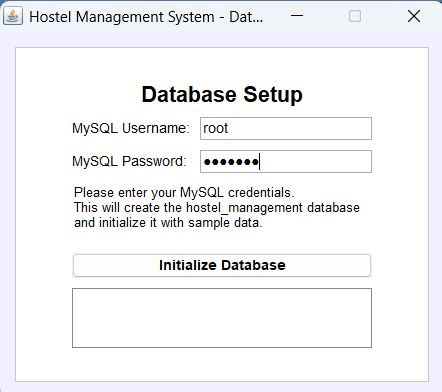
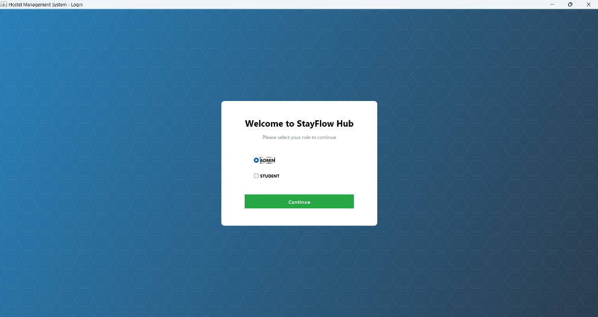
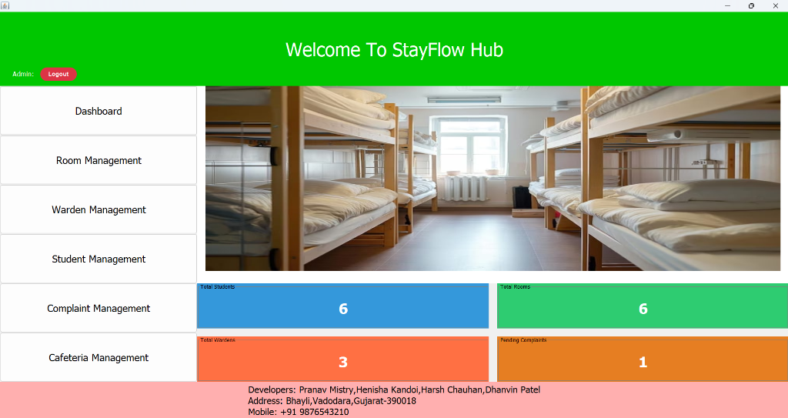
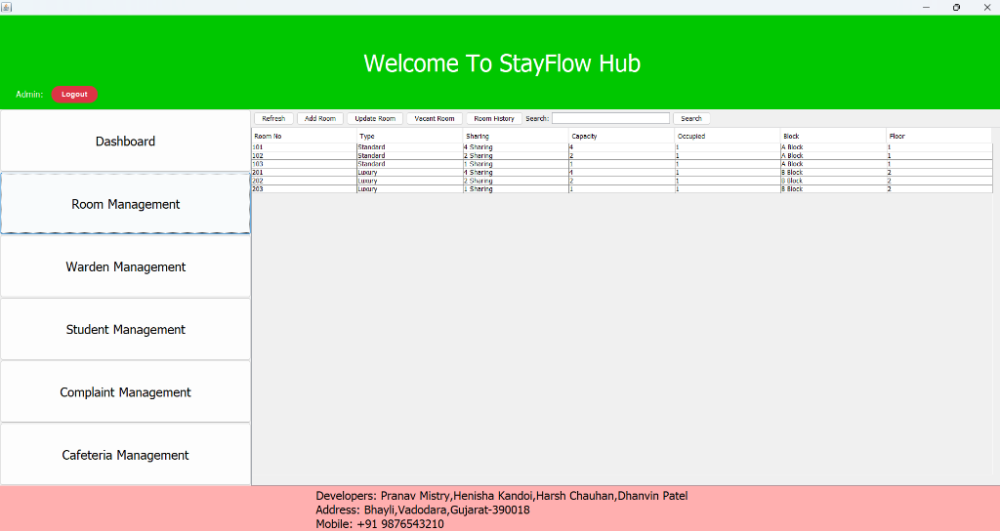
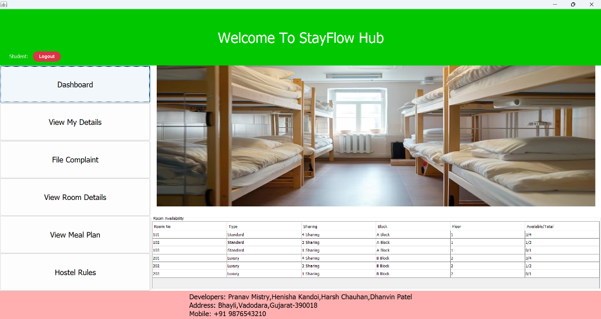

# StayFlow Hub 🏠 — Hostel Management System

**StayFlow Hub** is a desktop-based Hostel Management System built using **Java Swing** for a rich graphical user interface and **MySQL** for robust database management. This application simplifies hostel operations by providing specialized dashboards for both **Administrators** and **Hostel Residents (Students)**. It automates key tasks such as room allocation, warden tracking, student registration, cafeteria/meal plan subscriptions, and student complaint processing.

---

## 📸 Screenshots

Here is a visual walkthrough of the StayFlow Hub application:

| 🔑 1. Database Setup | 👥 2. Role Selection |
|:---:|:---:|
|  |  |
| **📊 3. Admin Dashboard** | **🛏️ 4. Room Management** |
|  |  |
| **🎓 5. Student Dashboard** | |
|  | |

---

## ✨ Features

### 👤 Administrator Panel
* **Live Dashboard Metrics**: Instantly view metrics like Total Students, Total Rooms, Total Wardens, and Pending Complaints.
* **Room Management**: Add, update, delete, and view rooms (Standard or Luxury, sharing capacities, block names, and floor levels).
* **Warden Tracking**: Manage warden rosters (Warden ID, name, age, contact, assigned hostel, and block).
* **Student Directory (CRUD)**: Easily enroll new students, edit profiles, check registration details, and record fee transactions.
* **Complaint Resolution**: View complaints submitted by students, update processing status (Pending, In-Progress, Resolved), and log resolution timestamps.
* **Cafeteria & Meals**: Monitor student meal plans, view user feedback, and modify daily dining menus.

### 🎓 Student (Resident) Panel
* **Availability Viewer**: Check real-time room occupancies (Standard vs. Luxury, Sharing capacities, and Block details).
* **Profile Management**: View personal student details, payment history, amounts paid, outstanding dues, and update credentials.
* **Complaint Box**: Lodge complaints directly to administrators and track resolution progress.
* **Meal Plan Center**:
  * View features & menus for different plans (**Basic**, **Standard**, **Premium**).
  * Check the daily breakfast, lunch, and dinner menus.
  * Submit dining feedback directly to the administration.

---

## 🛠️ Technology Stack

* **GUI Framework**: Java Swing (AWT, `javax.swing`)
* **Language**: Java SE (JDK 8 or higher)
* **Database**: MySQL (relational database storage)
* **Driver**: JDBC (MySQL Connector/J)
* **Build Tool**: Ant (standard NetBeans structure)

---

## 🗃️ Database Schema

The database (`hostel_management`) automatically initializes itself on setup. The key entities include:
* `admins`: Login credentials for host administrators.
* `students`: Host details, fees paid/due, passwords, and room keys.
* `rooms`: Room numbers, type (Standard/Luxury), sharing capacity, and floor.
* `wardens`: Warden details and block assignments.
* `complaints`: Student complaints, status updates, and logging timestamps.
* `meal_plan_details`: Information on basic, standard, and premium plans.
* `meal_plans`: Links student subscriptions to active meal plans.
* `daily_menu`: Today's dining menu details.
* `meal_feedback`: Feedback comments written by students.
* `payment_history`: Records of payment transactions.
* `room_history`: Tracking log of room allocations/vacations.

---

## 🚀 Setup & Installation Instructions

Follow these steps to run the project on your local machine:

### Prerequisites
1. **Java Development Kit (JDK)**: Version 8 or higher installed and added to your system environment variables.
2. **MySQL Server**: Installed and running (usually on default port `3306`).
3. **IDE (Optional but recommended)**: NetBeans IDE, Eclipse, or IntelliJ IDEA.

### Step 1: Clone the Repository
```bash
git clone https://github.com/YOUR_USERNAME/Hostel-Management-Swing-StayFlow_HUB.git
cd Hostel-Management-Swing-StayFlow_HUB
```

### Step 2: Database Initialization (Automatic)
The application is designed to create the database and seed it automatically:
1. Open the project in **NetBeans** or run the application (see Step 3).
2. Upon first launch, the **Database Setup** window will appear.
3. Enter your MySQL **Username** (defaults to `root`) and MySQL **Password**.
4. Click **Initialize Database**.
5. The application will automatically create the database `hostel_management` and insert all required tables and sample data.

### Step 3: Compile and Run
#### Using NetBeans IDE:
1. Open NetBeans.
2. Go to `File` -> `Open Project` and select the `Hostel-Management-CLI` directory.
3. Right-click the project name in the left panel and select **Clean and Build**.
4. Right-click the project and select **Run** (or press `F6`).

#### Using Command Line:
Navigate to the `Hostel-Management-CLI` directory and compile/run the project:
```bash
# Clean and build with ant (if Ant is installed)
ant clean compile jar

# Execute the project jar
java -jar dist/Hostel-Management-CLI.jar
```

---

## 👥 Developers

* **Pranav Mistry** (NUV, CSE)
* **Henisha Kandoi** (NUV, CSE)
* **Harsh Chauhan** (NUV, CSE)
* **Dhanvin Patel** (NUV, CSE)

---

## 📄 License
This project is open-source and available under the [MIT License](LICENSE).
